# FS-0003

Aplicación web full-stack tipo blog con autenticación JWT, roles de usuario (USER / ADMIN), CRUD de posts, comentarios, categorías, búsqueda, carga de imágenes a Cloudinary y panel de administración.

> Amplix Acceleration Program — Javascript.

---

## Tech Stack

| Capa | Tecnología |
|------|-----------|
| **Backend** | Node.js + Express 5 |
| **Frontend** | React 19 + Vite 6 |
| **Base de datos** | PostgreSQL 16 |
| **ORM** | Prisma 6 |
| **Autenticación** | JWT (jsonwebtoken) + bcrypt |
| **Validación** | Joi |
| **Subida de archivos** | Multer + Cloudinary |
| **Tests** | Vitest + React Testing Library + proxyquire |
| **Contenedores** | Docker |

---

## Screenshots

| Home | Home — búsqueda | Home — mobile |
|:----:|:---------------:|:-------------:|
| 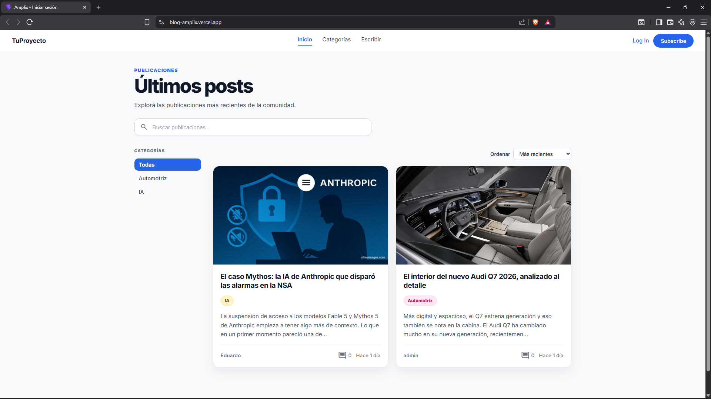 | 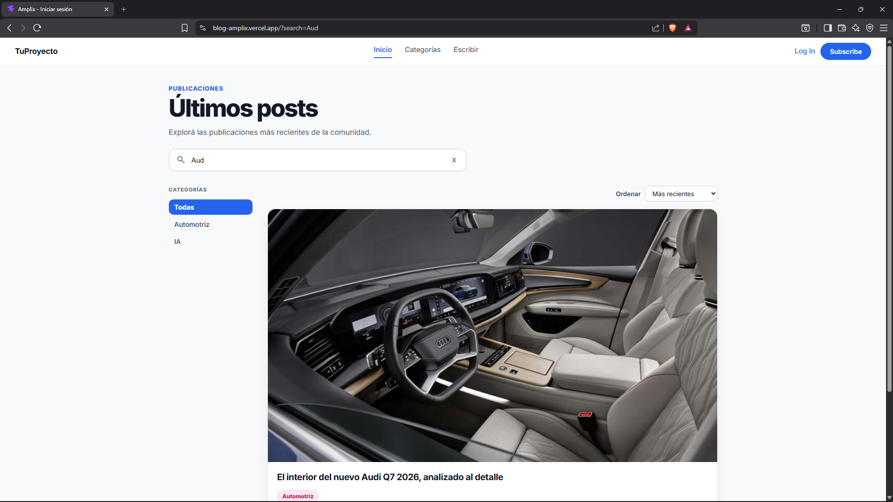 | 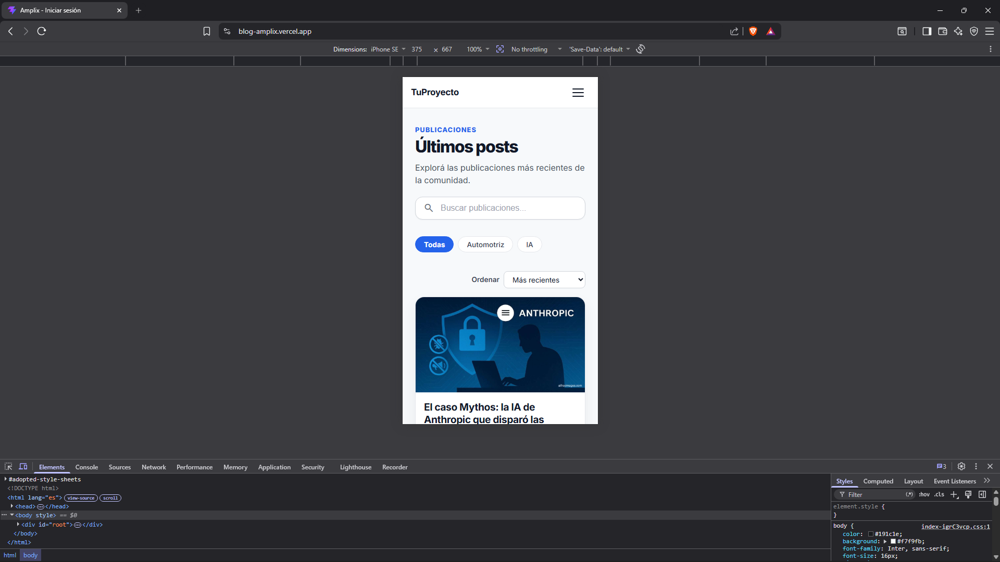 |

| Login | Registro | Detalle de post |
|:-----:|:--------:|:---------------:|
| 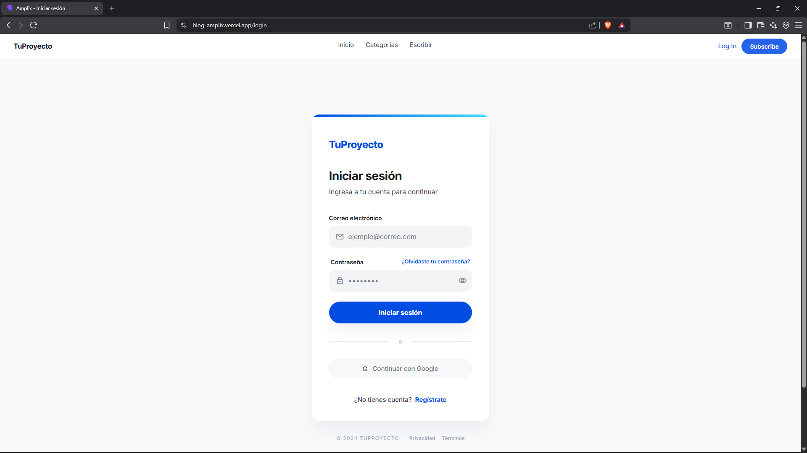 | 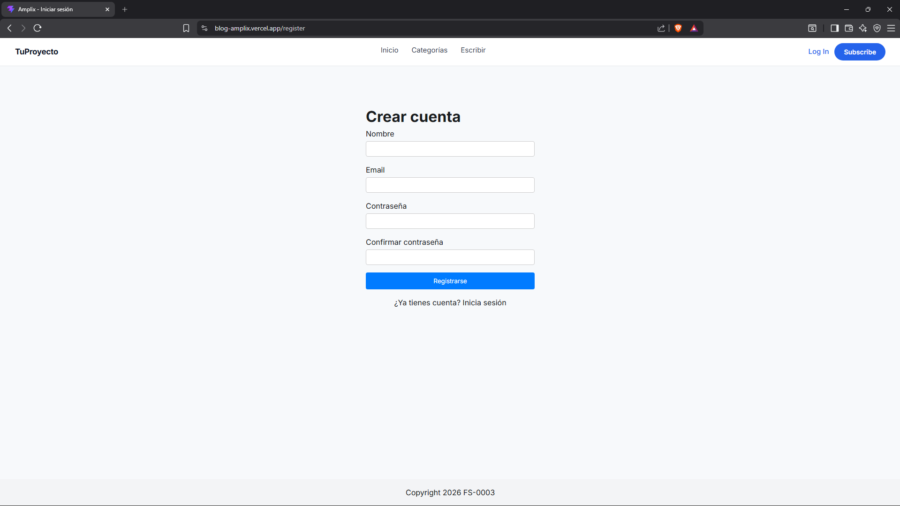 | 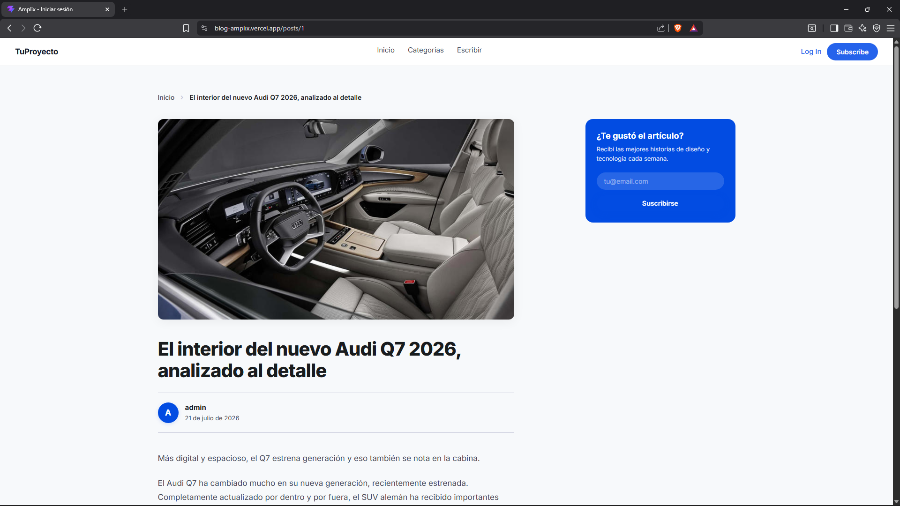 |

| Crear post | Editar post | Perfil público |
|:----------:|:-----------:|:--------------:|
| 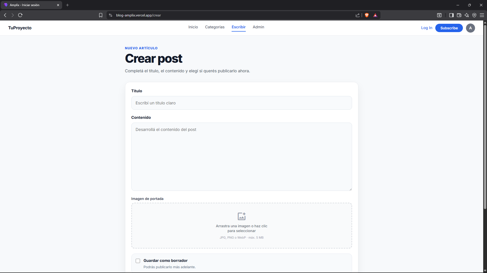 | 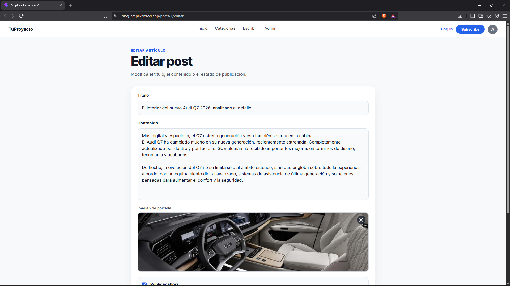 | 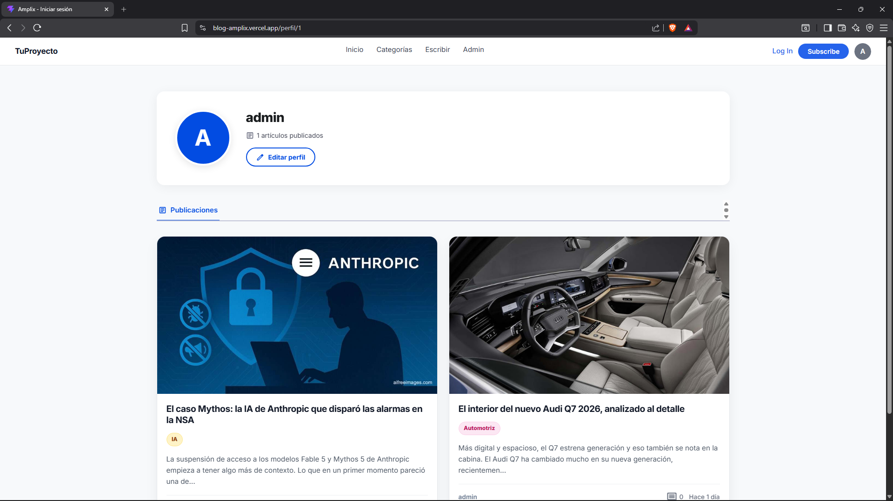 |

| Editar perfil | Categorías | Modal confirmación |
|:-------------:|:----------:|:------------------:|
| 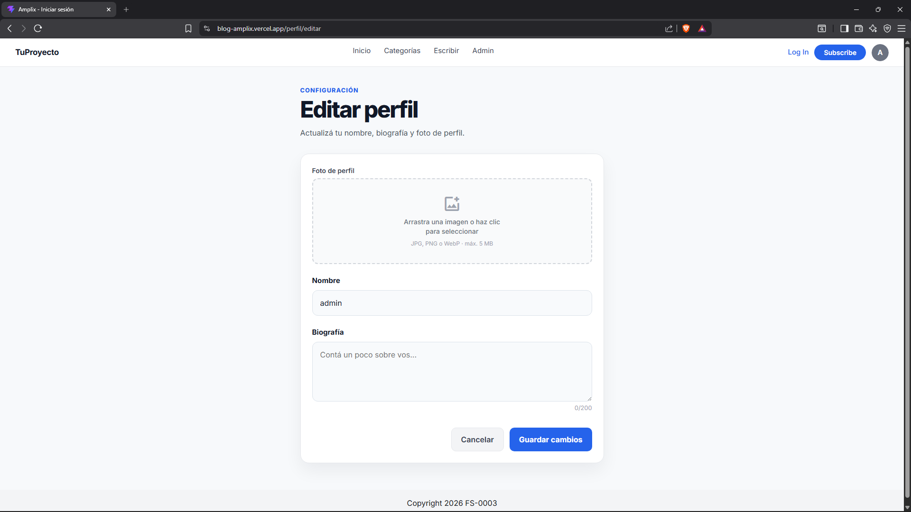 | 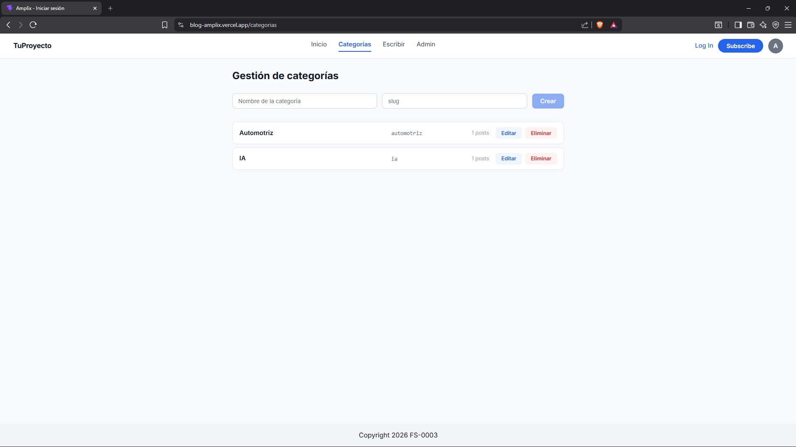 | 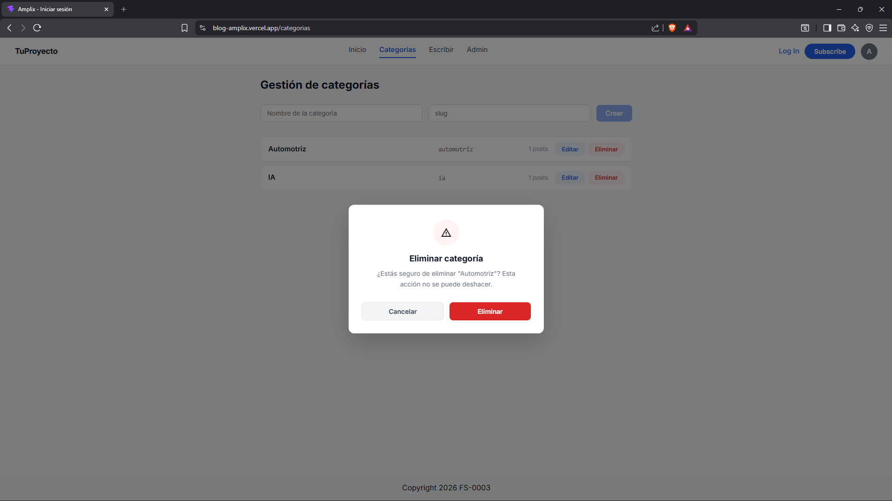 |

| Admin — stats | Admin — usuarios | Admin — posts |
|:-------------:|:----------------:|:-------------:|
| 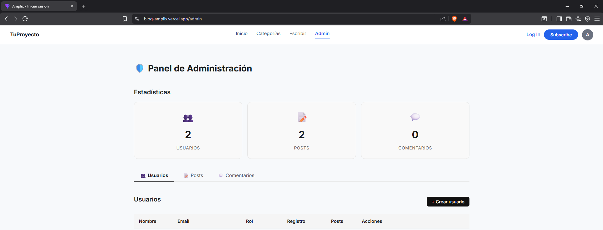 | 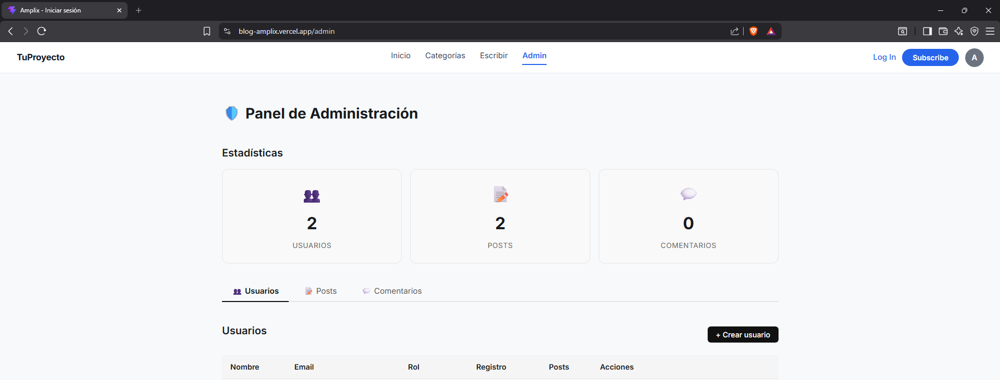 | 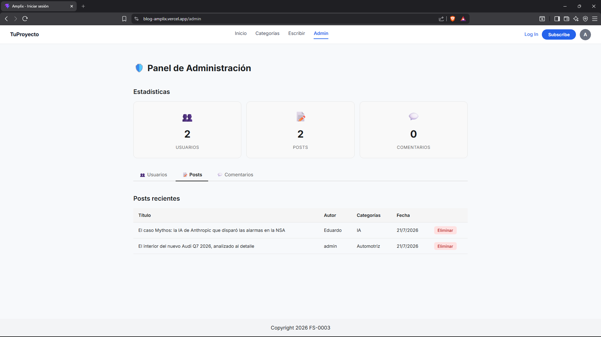 |

| Admin — comments | API Docs (Swagger) |
|:----------------:|:------------------:|
| 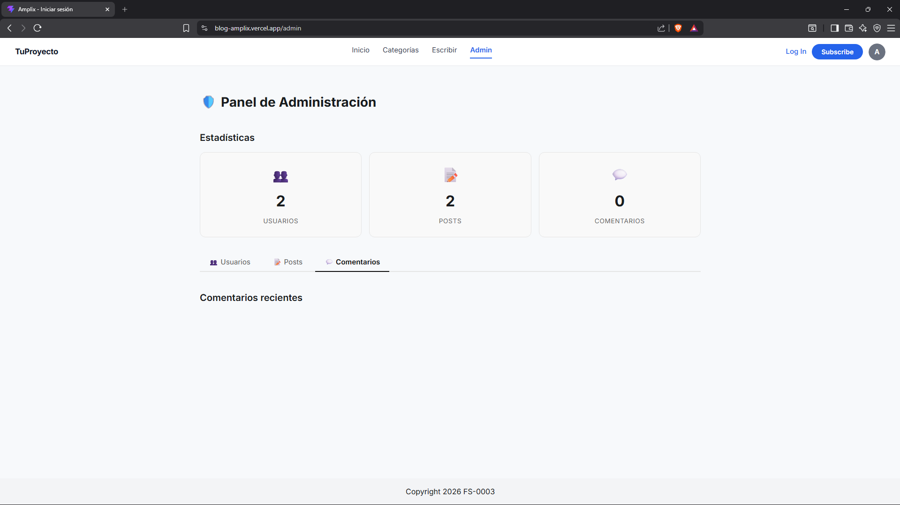 | 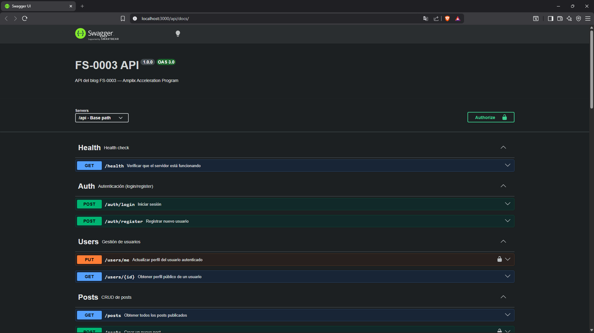 |

---

## URLs de producción

| Servicio | URL |
|----------|-----|
| **Frontend** | https://fs-0003.vercel.app |
| **Backend** | https://fs-0003-backend.onrender.com |
| **API Docs (Swagger)** | https://fs-0003-backend.onrender.com/api/docs |

---

## Setup local

### Requisitos

- Node.js 20+
- Docker Desktop (instalado y corriendo)

### 1. Clonar el repositorio

```bash
git clone https://github.com/amplixme/FS-0003.git
cd FS-0003
```

### 2. Configurar variables de entorno

```bash
cp backend/.env.example backend/.env
cp frontend/.env.example frontend/.env
```

### 3. Iniciar PostgreSQL con Docker

```bash
docker compose -f backend/docker-compose.yml up -d
```

### 4. Backend

```bash
cd backend
npm install
npx prisma db push
npm run dev
```

El backend arranca en `http://localhost:3000`.

### 5. Frontend

En otra terminal:

```bash
cd frontend
npm install
npm run dev
```

El frontend arranca en `http://localhost:5173`.

### 6. Documentación de la API

Con el backend corriendo, visitar:

```
http://localhost:3000/api/docs
```

---

## Scripts disponibles

### Backend (`backend/`)

| Script | Descripción |
|--------|-------------|
| `npm run dev` | Inicia servidor con nodemon (hot reload) |
| `npm start` | Inicia servidor en producción |
| `npm test` | Ejecuta tests con Vitest |
| `npm run db:push` | Sincroniza schema de Prisma con la BD |
| `npm run db:migrate` | Crea migración de Prisma |
| `npm run db:generate` | Genera el cliente de Prisma |

### Frontend (`frontend/`)

| Script | Descripción |
|--------|-------------|
| `npm run dev` | Inicia servidor de desarrollo Vite |
| `npm run build` | Compila para producción |
| `npm run preview` | Vista previa del build compilado |
| `npm run lint` | Ejecuta ESLint |
| `npm test` | Ejecuta tests con Vitest |

---

## Tests

```bash
# Backend (18 tests)
cd backend && npm test

# Frontend (28 tests)
cd frontend && npm test

# Total: 46 tests
```

---

## Endpoints de la API

La API está completamente documentada con Swagger/OpenAPI 3.0.

**Interactivo:** `https://fs-0003-backend.onrender.com/api/docs`  
**JSON:** `https://fs-0003-backend.onrender.com/api/docs.json`

| Grupo | Método | Ruta | Auth | Descripción |
|-------|--------|------|------|-------------|
| **Health** | GET | `/api/health` | — | Health check |
| **Auth** | POST | `/api/auth/register` | — | Registrar usuario |
| | POST | `/api/auth/login` | — | Iniciar sesión |
| **Users** | GET | `/api/users/:id` | — | Perfil público |
| | PUT | `/api/users/me` | JWT | Actualizar perfil |
| **Posts** | GET | `/api/posts` | — | Listar posts (paginado, filtros) |
| | GET | `/api/posts/:id` | — | Obtener post |
| | POST | `/api/posts` | JWT | Crear post |
| | PUT | `/api/posts/:id` | JWT | Actualizar post (autor o admin) |
| | DELETE | `/api/posts/:id` | JWT | Eliminar post (autor o admin) |
| **Comments** | GET | `/api/posts/:postId/comments` | — | Comentarios de un post |
| | POST | `/api/posts/:postId/comments` | JWT | Crear comentario |
| | PUT | `/api/comments/:id` | JWT | Actualizar comentario |
| | DELETE | `/api/comments/:id` | JWT | Eliminar comentario |
| **Categories** | GET | `/api/categories` | — | Listar categorías |
| | GET | `/api/categories/:id` | — | Obtener categoría |
| | POST | `/api/categories` | ADMIN | Crear categoría |
| | PUT | `/api/categories/:id` | ADMIN | Actualizar categoría |
| | DELETE | `/api/categories/:id` | ADMIN | Eliminar categoría |
| **Upload** | POST | `/api/upload` | JWT | Subir imagen |
| **Admin** | GET | `/api/admin/stats` | ADMIN | Estadísticas |
| | GET | `/api/admin/users` | ADMIN | Listar usuarios |
| | POST | `/api/admin/users` | ADMIN | Crear usuario |
| | PATCH | `/api/admin/users/:id/role` | ADMIN | Cambiar rol |
| | PATCH | `/api/admin/users/:id` | ADMIN | Actualizar usuario |
| | DELETE | `/api/admin/users/:id` | ADMIN | Eliminar usuario |
| | GET | `/api/admin/posts` | ADMIN | Posts recientes |
| | DELETE | `/api/admin/posts/:id` | ADMIN | Eliminar post |
| | GET | `/api/admin/comments` | ADMIN | Comentarios recientes |
| | DELETE | `/api/admin/comments/:id` | ADMIN | Eliminar comentario |

---

## Estructura del proyecto

```
FS-0003/
├── backend/
│   ├── prisma/              # Schema y migraciones
│   ├── src/
│   │   ├── config/          # Configuración (Swagger)
│   │   ├── controllers/     # Controladores Express
│   │   ├── middlewares/      # Auth, role, validation, error, upload
│   │   ├── routes/          # Definición de rutas + docs Swagger
│   │   ├── services/        # Lógica de negocio
│   │   │   └── __tests__/   # Tests unitarios (auth + post service)
│   │   └── utils/           # Prisma client, AppError, response helpers
│   └── docker-compose.yml
├── frontend/
│   ├── src/
│   │   ├── assets/          # Imágenes estáticas
│   │   ├── components/      # Componentes reutilizables
│   │   │   ├── common/      # ConfirmModal, ImageUpload, SearchInput
│   │   │   ├── comments/    # CommentSection
│   │   │   └── posts/       # PostCard
│   │   ├── context/         # AuthContext
│   │   ├── pages/           # HomePage, LoginPage, RegisterPage, etc.
│   │   ├── services/        # API client
│   │   └── test/            # Test setup
│   └── vercel.json
├── screenshots/             # Capturas de pantalla para el README
└── README.md
```

---

## Variables de entorno

### Backend (`backend/.env`)

| Variable | Descripción |
|----------|-------------|
| `PORT` | Puerto del servidor Express (default: 3000) |
| `DATABASE_URL` | URL de conexión a PostgreSQL |
| `JWT_SECRET` | Secreto para firmar tokens JWT |
| `CLOUDINARY_URL` | Credenciales de Cloudinary |

### Frontend (`frontend/.env`)

| Variable | Descripción |
|----------|-------------|
| `VITE_API_URL` | URL base de la API backend |
